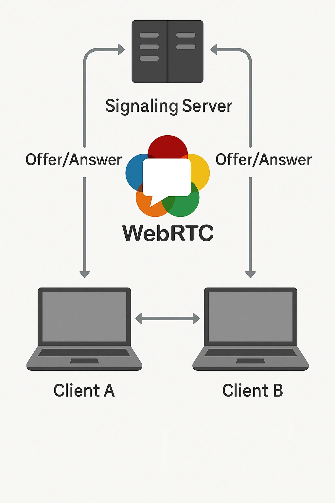

# Virtual Office App

## Project Overview

The Virtual Office App is designed to facilitate seamless communication and collaboration in a virtual environment. It leverages modern web technologies to provide real-time interaction capabilities, making remote work more efficient and engaging. The application integrates video conferencing to simulate a physical office experience. Users can move around a virtual map, enhancing the interactive and immersive experience of the virtual office.

## Getting Started

To run the project locally after cloning the repository, follow these steps:

1. **Clone the repository:**

   ```bash
   git clone <repository-url>
   ```

2. **Navigate to the project directory:**

   ```bash
   cd <project-directory>
   ```

3. **Install dependencies for the client:**

   ```bash
   cd client
   npm install
   ```
4. **Build frontend code:**
    
    ```bash
    npm run-script build
    ```

5. **Start your frontend server:**
    
    ```bash
    npx serve -s build `
    ```

6. **Open up a browser window and go to:**
    
    ```bash
    http://localhost:3000/
    ```

4. **Configure Firebase:**

   - Create a Firebase project in the [Firebase Console](https://console.firebase.google.com/).
   - Add a new web app to your Firebase project.
   - Copy the Firebase configuration object.
   - Create a `.env` file in the `client` directory and add your Firebase credentials:

     ```plaintext
     REACT_APP_FIREBASE_API_KEY=your_api_key
     REACT_APP_FIREBASE_AUTH_DOMAIN=your_auth_domain
     REACT_APP_FIREBASE_PROJECT_ID=your_project_id
     REACT_APP_FIREBASE_STORAGE_BUCKET=your_storage_bucket
     REACT_APP_FIREBASE_MESSAGING_SENDER_ID=your_messaging_sender_id
     REACT_APP_FIREBASE_APP_ID=your_app_id
     ```

5. **Start the client application:**

   ```bash
   npm start
   ```

6. **Install dependencies for the server:**

   ```bash
   cd ../server
   npm install
   ```
7. **Go to server source directory:**
   
    ```bash
    cd src
    ```

8. **Start your backend server:**
 
    ```bash
    node index.js
    ```
 If it starts successfully, you should see “Server is running on port 8080”


## Architecture Overview

The Virtual Office App is structured into two main components: the client and the server.

- **Client:** Built with React, the client application provides the user interface and handles user interactions. It uses libraries such as Redux for state management and Socket.IO for real-time communication. WebRTC is utilized for peer-to-peer video conferencing, enabling direct media streaming between users without the need for an intermediary server.

- **Server:** The server is built with Express.js and handles the backend logic, including API endpoints and WebSocket connections. It uses Socket.IO to manage real-time events and interactions between clients.

The client and server communicate over WebSockets to ensure low-latency interactions, making the virtual office experience smooth and responsive. WebRTC is a key component in providing high-quality, real-time video and audio communication.


